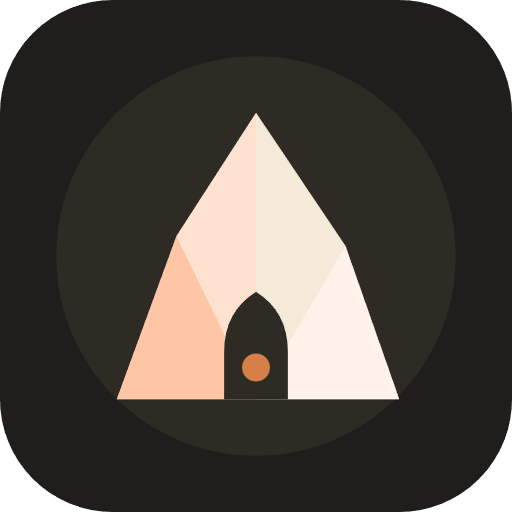

<p align="center">
  
</p>

<h1 align="center">qsd77</h1>

<p align="center">
  A short, friendly command for controlling
  <a href="https://github.com/dani-77/quickshell-d77">quickshell-d77</a> and
  <a href="https://github.com/dani-77/utumno">Utumno</a> from a terminal, a keybind, or a
  script — without typing out a full <code>qs ipc call ...</code> command every time.
</p>

---

## What is this?

Both quickshell-d77 and Utumno are controlled through short remote commands — opening
the launcher, locking the screen, changing the wallpaper, and so on. `qsd77` wraps those
commands into a single, memorable tool, so instead of:

```sh
qs -c quickshell-d77 ipc call launcher toggle
```

you just type:

```sh
qsd77 launcher
```

It works with **either** shell: it talks to quickshell-d77 by default, and to Utumno
with one extra flag.

## Before you install

You need [Quickshell](https://quickshell.org) (the `qs` command) with
[quickshell-d77](https://github.com/dani-77/quickshell-d77) or
[Utumno](https://github.com/dani-77/utumno) already installed and running — `qsd77` is a
convenience wrapper around them, not a replacement.

## Installing

```sh
git clone https://github.com/dani-77/qsd77.git ~/qsd77
cd ~/qsd77
sudo make install
```

That builds the tool and installs it to `/usr/bin/qsd77`. To uninstall later:

```sh
sudo make uninstall
```

## Using it

```sh
qsd77 launcher     # open the app launcher
qsd77 wallpaper    # open the wallpaper picker
qsd77 locker       # lock the screen
qsd77 session      # open the power/session menu
qsd77 dashboard    # open the dashboard
qsd77 ollama       # open the AI chat popup
```

By default these target quickshell-d77. If you're running **Utumno** instead, add
`-c utumno`:

```sh
qsd77 launcher -c utumno
qsd77 wallpaper -c utumno
```

### Launching a shell directly

`qsd77 run` starts a Quickshell config directly, instead of talking to one that's
already running — handy for a compositor's autostart:

```sh
qsd77 run                # starts quickshell-d77
qsd77 run -c utumno      # starts Utumno
```

### Shell autocompletion

Tab-completion for bash, fish and zsh can be generated on demand:

```sh
qsd77 completion bash
```

Follow your shell's usual instructions for loading a completion script (e.g. source the
output above from your `.bashrc`, or save it under your fish/zsh completions directory).

## Uninstalling

```sh
sudo make uninstall
```

## More

For the full command reference, including raw IPC passthrough for anything not covered
above, see the [technical documentation](doc/README.md).

## License

MIT — see [LICENSE](LICENSE).
